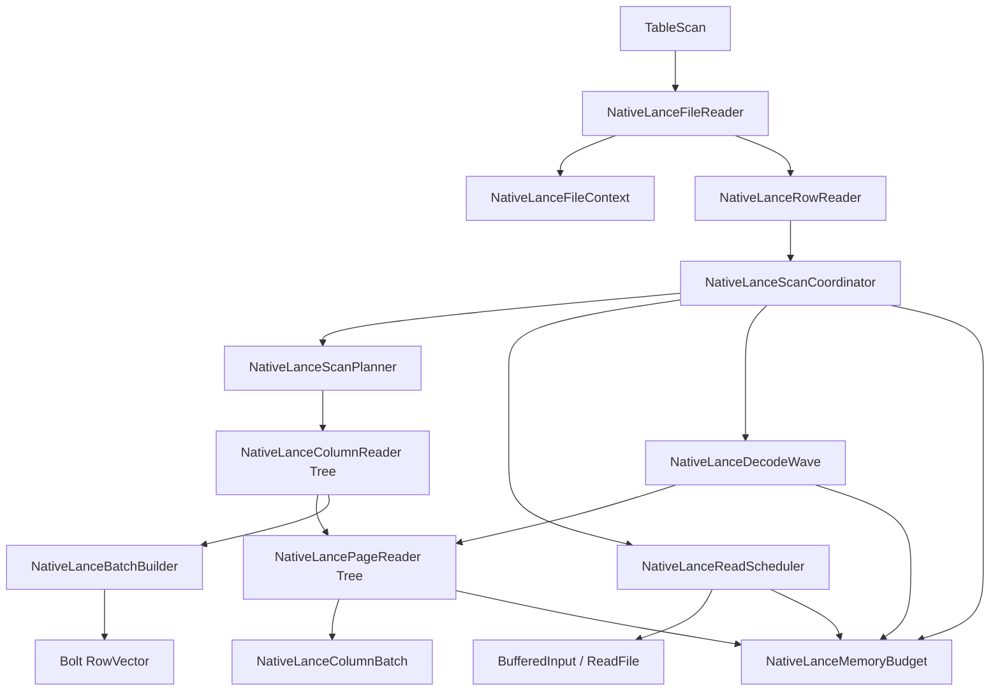
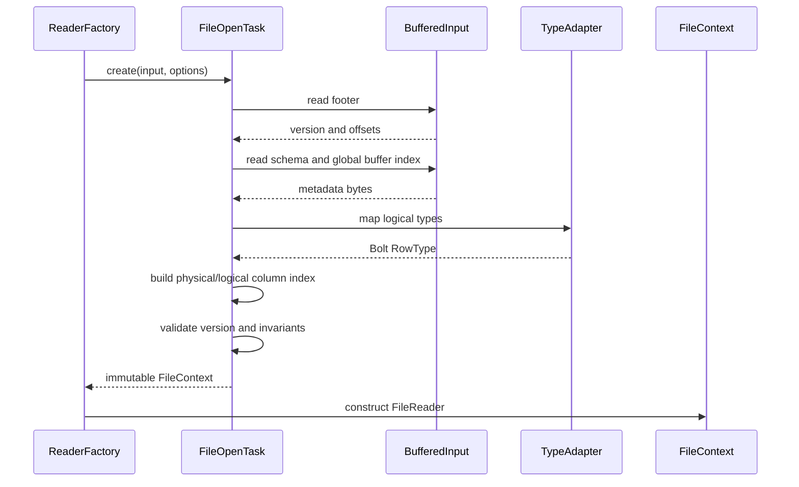
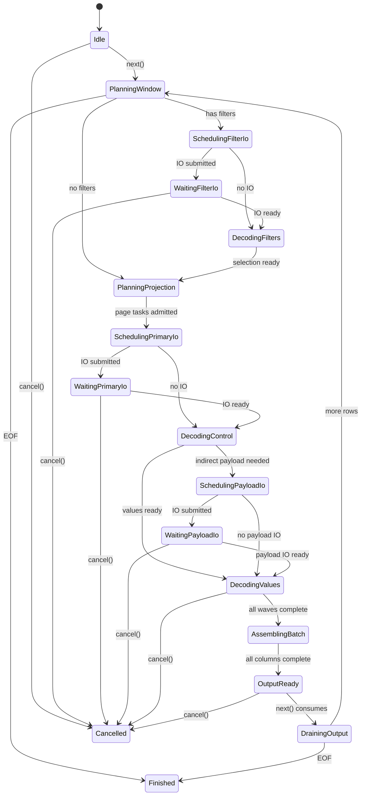
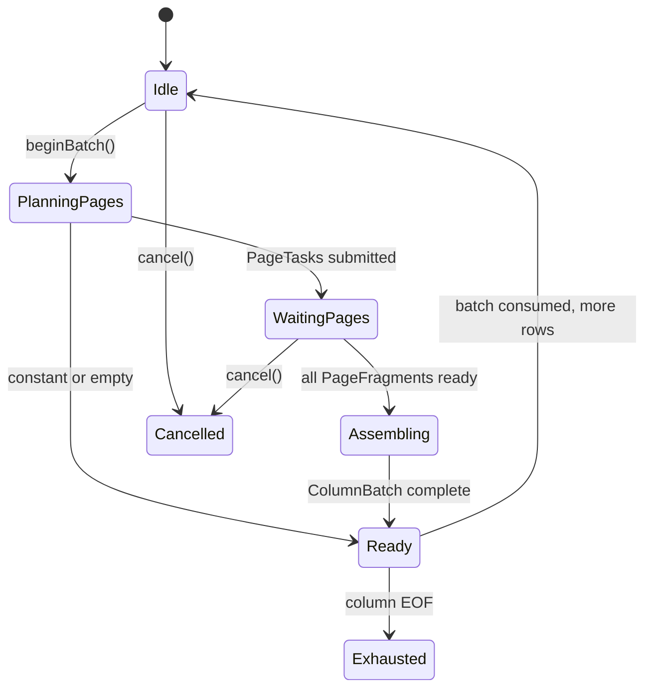
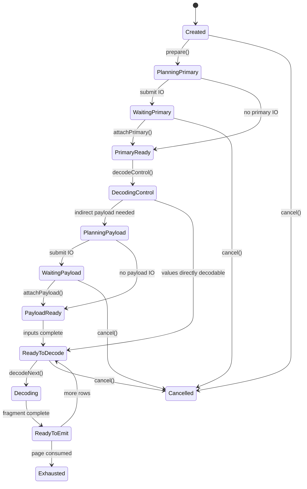
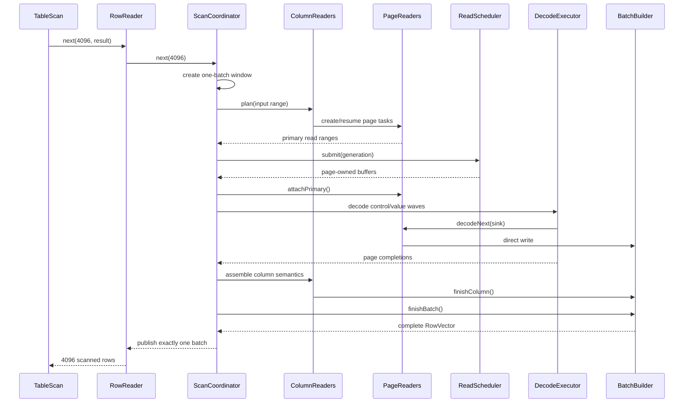
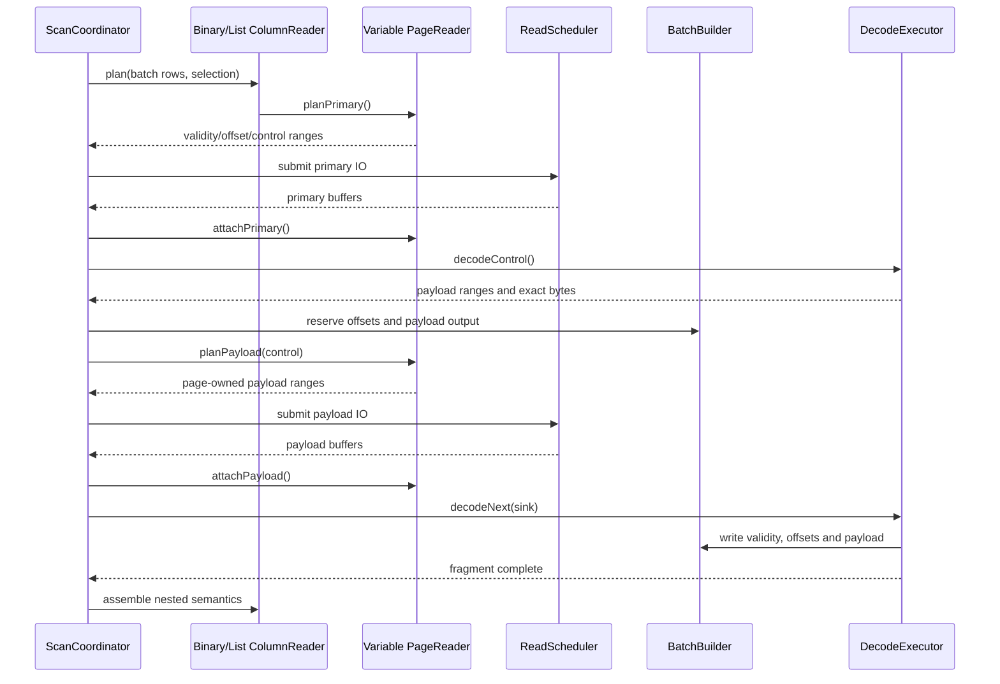
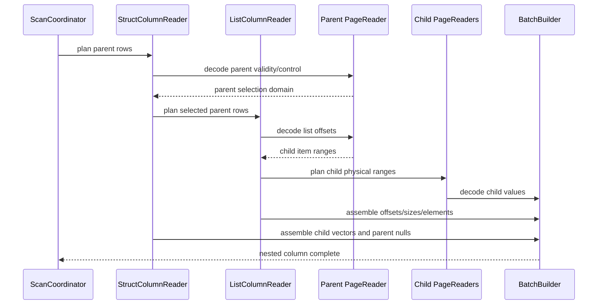
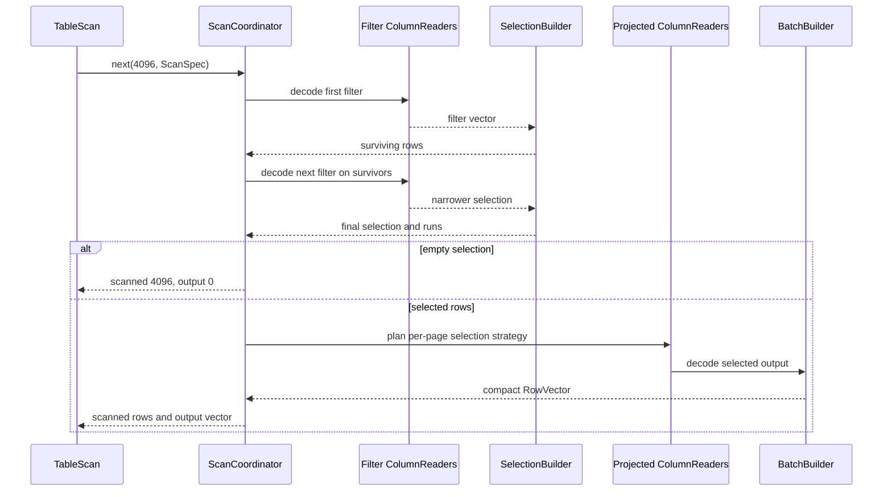
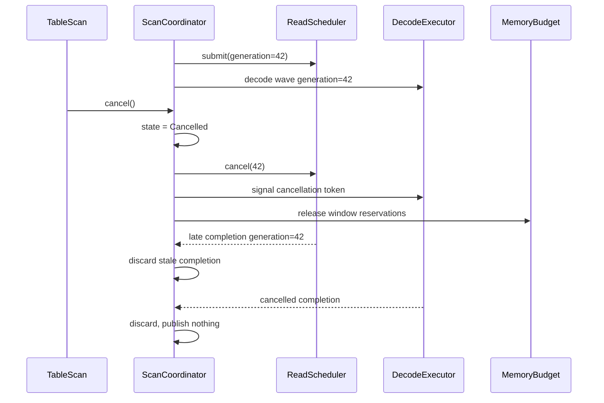

# Bolt Native Lance Reader 全量重构与状态机设计

状态：设计评审稿

目标目录：`bolt/dwio/lance`

主要场景：超宽表、受控内存、全表扫描、投影扫描与选择性过滤

## 1. 文档目标

本文给出 Bolt Native Lance Reader 的全量重构方案。重构范围不局限于新增
`PageReader`，而是重新定义从文件打开到 Bolt `RowVector` 交付的全部层次：

- `FileReader`：文件打开、不可变元数据、schema、split 与统计信息；
- `RowReader`：DWIO 扫描契约、游标、skip、mutation、输出批次；
- `ColumnReader`：逻辑类型树、投影、过滤、嵌套类型组装；
- `PageReader`：物理 page、I/O range、压缩格式和增量解码；
- I/O scheduler：range 合并、异步提交、取消、page-owned 结果；
- Decode coordinator：状态推进、并发 wave、内存准入和错误传播；
- Output builder：直接写入 Bolt vector，避免 page vector 再复制；
- Filter pipeline：先过滤、后物化，并按 page 能力选择读取策略。

最终结构不保留当前 `NativeLanceReaderBase`、`NativeLanceDecoder` 和
`NativeLanceReadPlan` 的组合。它们的职责将被拆分到边界清晰的新组件中。

本文采用 Concurrent Pipeline 作为扫描主状态机，并在文件打开、ColumnReader 和
PageReader 内使用小型线性状态机。全局状态只有一个 owner；I/O callback 和 decode
worker 只产生事件和不可变结果，不直接修改 reader 全局状态。

## 2. 结论摘要

目标架构的核心原则如下：

1. 物理 page 是 I/O、codec 状态和解压进度的唯一归属单元。
2. ColumnReader 只理解逻辑类型、投影、过滤和输出组装，不实现压缩算法。
3. PageReader 只理解物理编码和 page-local 进度，不决定输出列顺序。
4. 一个 output batch 对应一个有界 scan window；最多只允许一个完成但未交付的
   batch，禁止形成 decoded batch queue。
5. zstd 等可续流 codec 跨 output batch 只保留 codec cursor 和有界输入块，不保留
   完整解压 page。
6. bitpack、bitmap、mini-block 等可定位编码按请求范围或 block 解码。
7. raw LZ4 whole block 等不可续流编码显式选择 whole-buffer 或 restart 策略，不伪装
   成流式解码。
8. 每个 transient allocation 在执行前必须取得内存 reservation；并发度服从预算。
9. 一个 batch 的所有投影列成功后才原子发布；失败时不暴露部分结果。
10. 当前 monolithic decoder 最终删除，迁移期只作为未迁移编码的兼容 fallback。

## 3. 背景与已验证问题

当前 reader 的控制流绑定在 `RowReader::next()` 请求的 Bolt batch 上。每个 batch
都会重新执行以下工作：

1. 根据 row range 遍历 column/page metadata；
2. 建立所有列的 read plan；
3. 将 read plan materialize 到 Bolt buffer；
4. 对每个重叠 page 解压和解码；
5. 生成 page-local vector，再复制或拼装到 column vector；
6. 最后创建 root `RowVector`。

对于跨越多个 4096-row output batch 的压缩 page，同一个压缩 buffer 可能被多次完整
解压。共享 `NativeLanceReadPlan` 的 map 和 mutex 还会让并行 column decode 出现
串行临界区。

当前本地验收数据：

| 项目 | 值 |
|---|---:|
| 文件 | `/tmp/data-0ee2-v20-zstd9-full.lance` |
| 行数 | 402,385 |
| 列数 | 约 850 |
| 文件大小 | 523 MiB |
| 格式 | Lance v2.0，zstd level 9 |

已测结果：

| Reader | Batch rows | Wall time | Peak RSS |
|---|---:|---:|---:|
| Native，7 轮中位数 | 4,096 | 52.94 s | 约 7.50 GiB |
| Rust，7 轮中位数 | 4,096 | 7.60 s | 约 11.48 GiB |
| Native，单轮探针 | 8,192 | 30.76 s | 约 7.48 GiB |
| Native，单轮探针 | 16,384 | 18.25 s | 约 8.07 GiB |
| Rust，单轮探针 | 16,384 | 10.05 s | 约 27.03 GiB |

Native 随 batch size 增大而大幅加速，证明其主要损耗包含重复的 batch/page 固定工作。
Rust 在大 batch 下 RSS 激增，说明直接复制其激进 readahead 策略不符合超宽表的内存
目标。

## 4. 设计目标

### 4.1 功能目标

- 支持 Lance v2.0 至 v2.3 的现有兼容矩阵；
- 支持 full scan、projection、filter、delete bitmap、skip 和 split；
- 支持 primitive、string/binary、dictionary、list、map、struct、
  fixed-size-list、packed struct 和 blob；
- 保持 `dwio::common::Reader` 与 `RowReader` 对外接口不变；
- 保持现有 factory 和 TableScan 注册方式不变；
- 保持扩展类型通过 `NativeLanceTypeAdapter` fail-closed 映射。

### 4.2 性能目标

- 顺序扫描时 page metadata 不从 page 0 重复遍历；
- 可续流 compressed frame 不因 output batch 边界重新开始；
- 可定位编码只读请求范围或相交 block；
- decode worker 不访问共享可变 read-plan map；
- 优先直接写入最终 Bolt vector，量化并逐步消除中间 vector copy；
- I/O、control decode、payload I/O 和 value decode 在预算允许时重叠。

### 4.3 内存目标

- transient payload 内存具有可配置硬上限；
- 内存不随 `column_count * batch_readahead` 无界增长；
- 不存在 decoded-page cache、decompressed-page cache 或 decoded-batch queue；
- ready output 最多一批；
- 单个不可分割对象超过预算时必须记录 oversized operation，或者在 hard-limit 模式下
  明确失败；
- 所有 codec context、compressed chunk、control buffer、payload 和 scratch 都参与
  预算。

### 4.4 非目标

- 不修改 Lance 文件格式；
- 不提供跨 reader、跨 split 或跨 query 的 payload 复用；
- 不要求所有 codec 都支持随机 seek；
- 不在本次设计中重构 Bolt 通用 `BufferedInput`；
- 不为兼容旧结构而引入新的 reader-scoped cache。

## 5. 总体架构



数据与控制边界：

| 层次 | 输入 | 输出 | 唯一职责 |
|---|---|---|---|
| FileReader | 文件与 ReaderOptions | FileContext、RowReader | 打开文件并创建扫描 |
| RowReader | next/skip/mutation | Bolt RowVector | 适配 DWIO 契约 |
| ScanCoordinator | ScanRequest、事件 | 完整 DecodedBatch | 推进全局状态 |
| ScanPlanner | schema、ScanSpec、row range | ScanPlan | 构建不可变执行计划 |
| ColumnReader | ColumnRequest、PageResult | ColumnBatch | 逻辑类型和列组装 |
| PageReader | PageRequest、page-owned buffers | PageFragment | 物理编码和 codec 进度 |
| ReadScheduler | page-owned ranges | page-owned buffers | I/O 合并与执行 |
| BatchBuilder | ColumnBatch | RowVector | 最终 Bolt vector 所有权 |

## 6. 全量类设计

### 6.1 对外类

```cpp
class NativeLanceReaderFactory final : public dwio::common::ReaderFactory {
 public:
  std::unique_ptr<dwio::common::Reader> createReader(
      std::unique_ptr<dwio::common::BufferedInput> input,
      const dwio::common::ReaderOptions& options) override;
};

class NativeLanceFileReader final : public dwio::common::Reader {
 public:
  NativeLanceFileReader(
      std::unique_ptr<dwio::common::BufferedInput> input,
      const dwio::common::ReaderOptions& options,
      std::shared_ptr<const NativeLanceBlobResolver> blobResolver = nullptr,
      std::shared_ptr<const NativeLanceTypeAdapter> typeAdapter =
          defaultNativeLanceTypeAdapter());

  std::optional<uint64_t> numberOfRows() const override;
  const RowTypePtr& rowType() const override;
  const std::shared_ptr<const dwio::common::TypeWithId>& typeWithId()
      const override;
  std::unique_ptr<dwio::common::RowReader> createRowReader(
      const dwio::common::RowReaderOptions& options = {}) const override;
  std::unique_ptr<dwio::common::ColumnStatistics> columnStatistics(
      uint32_t index) const override;

 private:
  std::shared_ptr<const NativeLanceFileContext> context_;
};

class NativeLanceRowReader final : public dwio::common::RowReader {
 public:
  NativeLanceRowReader(
      std::shared_ptr<const NativeLanceFileContext> context,
      dwio::common::RowReaderOptions options);
  ~NativeLanceRowReader() override;

  int64_t nextRowNumber() override;
  int64_t nextReadSize(uint64_t size) override;
  uint64_t next(
      uint64_t size,
      VectorPtr& result,
      const dwio::common::Mutation* mutation = nullptr) override;
  uint64_t skip(uint64_t count) override;
  void updateRuntimeStats(
      dwio::common::RuntimeStatistics& stats) const override;
  void resetFilterCaches() override;
  std::optional<size_t> estimatedRowSize() const override;
  bool allPrefetchIssued() const override;
  std::optional<std::vector<PrefetchUnit>> prefetchUnits() override;

 private:
  std::unique_ptr<NativeLanceScanCoordinator> coordinator_;
};
```

`NativeLanceRowReader` 不再直接持有 decoder、prefetch input 数组、pipeline decoder 或
ColumnReader 实现细节。它只负责 DWIO 参数适配和调用 coordinator。

### 6.2 不可变 FileContext

```cpp
class NativeLanceFileContext {
 public:
  const NativeLanceFileMetadata& metadata() const;
  const NativeLanceSchemaIndex& schemaIndex() const;
  const RowTypePtr& rowType() const;
  const std::shared_ptr<const dwio::common::TypeWithId>& typeWithId() const;
  const std::shared_ptr<dwio::common::ReadFile>& readFile() const;
  memory::MemoryPool& pool() const;
  const NativeLanceReaderConfig& config() const;
  const std::shared_ptr<const NativeLanceBlobResolver>& blobResolver() const;

  std::unique_ptr<dwio::common::BufferedInput> newInput() const;

 private:
  friend class NativeLanceFileOpenTask;

  NativeLanceFileMetadata metadata_;
  NativeLanceSchemaIndex schemaIndex_;
  RowTypePtr rowType_;
  std::shared_ptr<const dwio::common::TypeWithId> typeWithId_;
  std::shared_ptr<dwio::common::ReadFile> readFile_;
  memory::MemoryPool& pool_;
  NativeLanceReaderConfig config_;
  std::shared_ptr<const NativeLanceBlobResolver> blobResolver_;
};
```

FileContext 构造完成后不可变。它可以共享 metadata、schema index 和底层 ReadFile，但不
共享 page payload、codec context、read plan 或 scan cursor。

### 6.3 扫描核心类

```cpp
class NativeLanceScanCoordinator {
 public:
  NativeLanceScanCoordinator(
      std::shared_ptr<const NativeLanceFileContext> context,
      dwio::common::RowReaderOptions options);

  uint64_t next(
      uint64_t requestedRows,
      VectorPtr& result,
      const dwio::common::Mutation* mutation);
  uint64_t skip(uint64_t count);
  void cancel();

  NativeLanceScanState state() const;
  const NativeLanceRuntimeStats& stats() const;
  std::optional<size_t> estimatedRowSize() const;

 private:
  DriveResult drive(const NativeLanceScanRequest& request);
  DriveResult executeState();
  void handleEvent(NativeLanceScanEvent event);
  void transition(
      NativeLanceScanState expected,
      NativeLanceScanState desired,
      std::string_view reason);
  void fail(std::exception_ptr error);

  mutable std::mutex mutex_;
  NativeLanceScanState state_{NativeLanceScanState::kIdle};
  uint64_t generation_{0};
  std::unique_ptr<NativeLanceScanPlan> plan_;
  std::optional<NativeLanceScanWindow> window_;
  std::optional<NativeLanceDecodedBatch> readyOutput_;
  std::exception_ptr failure_;
};
```

## 7. 文件打开状态机

文件打开是 Pattern 1 线性状态机。半初始化对象不会暴露给扫描层。

### 7.1 状态

```cpp
enum class NativeLanceFileOpenState : uint8_t {
  kNeedFooter,
  kNeedSchema,
  kNeedBufferIndex,
  kNeedColumnIndex,
  kNeedValidation,
  kReady,
  kFailed,
};
```

合法转移：

```text
kNeedFooter -> kNeedSchema
kNeedSchema -> kNeedBufferIndex
kNeedBufferIndex -> kNeedColumnIndex
kNeedColumnIndex -> kNeedValidation
kNeedValidation -> kReady
any non-terminal state -> kFailed
```

### 7.2 API

```cpp
class NativeLanceFileOpenTask {
 public:
  NativeLanceFileOpenTask(
      std::unique_ptr<dwio::common::BufferedInput> input,
      const dwio::common::ReaderOptions& options,
      std::shared_ptr<const NativeLanceBlobResolver> blobResolver,
      std::shared_ptr<const NativeLanceTypeAdapter> typeAdapter);

  bool executeStep();
  std::shared_ptr<const NativeLanceFileContext> finish();
  NativeLanceFileOpenState state() const;

 private:
  bool executeImpl();
  void readFooter();
  void readSchema();
  void readBufferIndex();
  void buildColumnIndex();
  void validate();

  NativeLanceFileOpenState state_{NativeLanceFileOpenState::kNeedFooter};
};
```

同步构造函数可循环调用 `executeStep()` 到完成。未来如果需要异步 open，同一个阶段机可
由 executor 驱动，不改变 FileContext。

### 7.3 打开时序



## 8. Metadata 重构

当前 `NativeLanceMetadata` 同时承担文件打开、lazy column metadata I/O、protobuf
存储、logical/physical mapping 和 split range 计算。目标结构拆为三个对象：

```cpp
class NativeLanceFileMetadata {
 public:
  const NativeLanceFooter& footer() const;
  uint64_t numRows() const;
  const std::vector<NativeLanceBufferDescriptor>& globalBuffers() const;
  const std::vector<NativeLanceColumnMetadataLocation>& columnLocations() const;
};

class NativeLanceSchemaIndex {
 public:
  const NativeLanceLogicalField& logicalField(uint32_t logicalIndex) const;
  const NativeLancePhysicalColumn& physicalColumn(uint32_t physicalIndex) const;
  folly::Range<const uint32_t*> physicalColumnsFor(
      uint32_t logicalIndex) const;
  std::vector<RowRange> rowRangesForFileRange(
      uint64_t offset,
      uint64_t length) const;
};

class NativeLanceColumnMetadataLoader {
 public:
  NativeLanceColumnMetadataBatch load(
      folly::Range<const uint32_t*> physicalColumns);
};
```

`FileMetadata` 和 `SchemaIndex` 不持有 payload。Column metadata 可以按 projection
加载，但结果属于 scan plan，不能写回一个全局 mutable payload cache。若后续确认
column metadata 本身需要跨 RowReader 共享，应单独定义只读 metadata cache，并与 page
payload 生命周期严格隔离。

## 9. ScanPlan

每个 RowReader 创建一次不可变 `NativeLanceScanPlan`。它将 selector、ScanSpec、
logical schema、physical columns、filter 和 output channel 固化，避免每个 batch 重建。

```cpp
struct NativeLanceColumnPlan {
  column_index_t outputChannel;
  uint32_t logicalColumn;
  TypePtr outputType;
  bool projected;
  bool filterOnly;
  bool constant;
  VectorPtr constantValue;
  std::unique_ptr<NativeLanceColumnReader> reader;
};

class NativeLanceScanPlan {
 public:
  const RowTypePtr& outputType() const;
  folly::Range<const NativeLanceColumnPlan*> columns() const;
  folly::Range<const uint32_t*> filterOrder() const;
  folly::Range<const RowRange*> rowRanges() const;
  bool hasFilters() const;
};

class NativeLanceScanPlanner {
 public:
  std::unique_ptr<NativeLanceScanPlan> build(
      const NativeLanceFileContext& context,
      const dwio::common::RowReaderOptions& options);
};
```

ScanPlan 只包含 schema、metadata descriptor 和 reader tree，不包含本批 I/O buffer 或
decoded values。

## 10. 扫描主状态机

### 10.1 状态

```cpp
enum class NativeLanceScanState : uint8_t {
  kIdle,
  kPlanningWindow,
  kSchedulingFilterIo,
  kWaitingFilterIo,
  kDecodingFilters,
  kPlanningProjection,
  kSchedulingPrimaryIo,
  kWaitingPrimaryIo,
  kDecodingControl,
  kSchedulingPayloadIo,
  kWaitingPayloadIo,
  kDecodingValues,
  kAssemblingBatch,
  kOutputReady,
  kDrainingOutput,
  kFinished,
  kFailed,
  kCancelled,
};
```

### 10.2 状态图



所有非终态均可在不可恢复错误后转入 `kFailed`。图中省略这些重复箭头。

### 10.3 转移所有权

- coordinator thread 是唯一可以提交 reader-level transition 的线程；
- I/O scheduler 只能发送 `kIoCompleted`、`kIoFailed` 事件；
- worker 只能发送 `kDecodeCompleted`、`kDecodeFailed` 事件；
- callback 不持有 coordinator mutex 执行 I/O 或 decode；
- event 带 generation，取消后的迟到事件直接丢弃；
- `kFinished`、`kFailed`、`kCancelled` 为终态。

## 11. ScanWindow

一个 window 对应一个 `next(requestedRows)` 的 output batch，不跨 batch 保存 decoded
vector。

```cpp
enum class NativeLanceWindowState : uint8_t {
  kCreated,
  kFiltersReady,
  kPagesPlanned,
  kPrimaryReady,
  kControlReady,
  kPayloadReady,
  kValuesReady,
  kAssembled,
  kReleased,
};

struct NativeLanceScanWindow {
  NativeLanceWindowState state{NativeLanceWindowState::kCreated};
  uint64_t generation{0};
  RowRange inputRows;
  RowSelection selection;
  uint64_t reservedBytes{0};

  std::vector<NativeLanceColumnBatch> columnBatches;
  std::deque<NativeLanceDecodeWave> waves;
  std::unique_ptr<NativeLanceBatchBuilder> output;

  bool complete() const;
  void release();
};
```

跨 batch 允许保留的对象只有 active ColumnReader/PageReader session。这些 session 只能
持有：

- logical/physical row cursor；
- codec context；
- bounded compressed input chunk；
- 不完整 value 的少量尾字节；
- 下一次 I/O 的 file offset。

禁止跨 batch 保留完整 decompressed page、page-local vector、payload buffer 或 output
batch。

## 12. ColumnReader 全量重构

### 12.1 职责

ColumnReader 是逻辑类型层，负责：

- 将 logical field 映射到一个或多个 physical page streams；
- 根据 projection 和 ScanSpec 创建 reader tree；
- 协调 filter-first 与 materialize-after-filter；
- 为 nested type 传播 parent selection；
- 将 PageFragment 组装为 Bolt column；
- 管理 logical row 与 child item row 的转换；
- 管理常量列、缺失列和扩展类型。

ColumnReader 不负责：

- 解析 footer；
- 直接调用 `BufferedInput`；
- zstd/lz4/bitpack/FSST 解压；
- 在全局 map 中查找 buffer；
- 管理 reader 级并发和内存预算。

### 12.2 ColumnReader 状态机

```cpp
enum class NativeLanceColumnState : uint8_t {
  kIdle,
  kPlanningPages,
  kWaitingPages,
  kAssembling,
  kReady,
  kExhausted,
  kFailed,
  kCancelled,
};
```



### 12.3 基类 API

```cpp
struct NativeLanceColumnRequest {
  RowRange inputRows;
  RowSelection selection;
  column_index_t outputChannel;
  DecodePurpose purpose;
};

struct NativeLancePageTaskSpec {
  NativeLancePageKey page;
  RowRange logicalRows;
  RowSelection selection;
  TypePtr outputType;
  std::string logicalType;
  DecodePurpose purpose;
};

struct NativeLanceColumnBatch {
  column_index_t outputChannel;
  vector_size_t outputSize;
  VectorPtr vector;
  uint64_t retainedBytes;
};

class NativeLanceColumnReader {
 public:
  virtual ~NativeLanceColumnReader() = default;

  virtual NativeLanceColumnState state() const = 0;
  virtual const TypePtr& outputType() const = 0;
  virtual bool filterCapable() const = 0;

  virtual std::vector<NativeLancePageTaskSpec> plan(
      const NativeLanceColumnRequest& request) = 0;

  virtual NativeLanceColumnBatch assemble(
      const NativeLanceColumnRequest& request,
      folly::Range<NativeLancePageFragment*> fragments,
      NativeLanceBatchBuilder& output) = 0;

  virtual void consume(const NativeLanceColumnBatch& batch) = 0;
  virtual void skip(uint64_t logicalRows) = 0;
  virtual void cancel() = 0;
};
```

### 12.4 ColumnReader 类型树

```text
NativeLanceColumnReader
|- NativeLanceConstantColumnReader
|- NativeLanceScalarColumnReader
|- NativeLanceBinaryColumnReader
|- NativeLanceDictionaryColumnReader
|- NativeLanceListColumnReader
|- NativeLanceMapColumnReader
|- NativeLanceStructColumnReader
|- NativeLanceFixedSizeListColumnReader
|- NativeLancePackedStructColumnReader
`- NativeLanceBlobColumnReader
```

各实现只包含逻辑层差异：

| Reader | 逻辑职责 |
|---|---|
| Scalar | 单 physical stream 到单 Bolt scalar vector |
| Binary | offsets/lengths 与 payload 的逻辑组装 |
| Dictionary | indices、dictionary values 与 DictionaryVector |
| List | parent rows 到 child item rows，offsets/sizes |
| Map | list-like entry rows，加 key/value 同步选择 |
| Struct | parent validity 与 child reader tree |
| FixedSizeList | parent rows 到固定 child domain |
| PackedStruct | 一个 physical stream 到多个 logical children |
| Blob | descriptor 到 resolved object payload |

### 12.5 ColumnReader 工厂

```cpp
class NativeLanceColumnReaderFactory {
 public:
  std::unique_ptr<NativeLanceColumnReader> create(
      const NativeLanceLogicalField& field,
      const common::ScanSpec* scanSpec,
      column_index_t outputChannel,
      const NativeLanceFileContext& context);
};
```

工厂在 RowReader 创建时构建完整 reader tree。运行过程中不根据 batch 重建 reader。

## 13. PageReader

### 13.1 唯一职责

PageReader 是物理层唯一 owner，负责：

- page encoding/layout；
- page-local row cursor；
- primary/control/payload range；
- codec capability 和 codec context；
- compressed input chunk；
- page-local decode；
- consumed buffer 释放；
- page-local stats。

它不创建 root RowVector，不理解 output channel，也不直接应用跨字段过滤。

### 13.2 PageReader 状态

```cpp
enum class NativeLancePageState : uint8_t {
  kCreated,
  kPlanningPrimary,
  kWaitingPrimary,
  kPrimaryReady,
  kDecodingControl,
  kPlanningPayload,
  kWaitingPayload,
  kPayloadReady,
  kReadyToDecode,
  kDecoding,
  kReadyToEmit,
  kExhausted,
  kFailed,
  kCancelled,
};
```

### 13.3 PageReader 状态图



### 13.4 PageReader API

```cpp
struct NativeLancePageKey {
  uint32_t physicalColumn;
  int32_t pageIndex;
};

struct NativeLancePageProgress {
  uint64_t nextLogicalRow;
  uint64_t rowsRemaining;
  uint64_t nextCompressedOffset;
  bool needsPrimaryIo;
  bool needsPayloadIo;
};

struct NativeLancePageFragment {
  NativeLancePageKey page;
  RowRange logicalRows;
  vector_size_t outputOffset;
  VectorPtr compatibilityVector;
  uint64_t directlyWrittenRows;
};

class NativeLancePageReader {
 public:
  virtual ~NativeLancePageReader() = default;

  virtual NativeLancePageKey key() const = 0;
  virtual NativeLancePageState state() const = 0;
  virtual NativeLancePageProgress progress() const = 0;

  virtual NativeLanceReadRequest planPrimary(
      const NativeLancePageTaskSpec& task) = 0;
  virtual void attachPrimary(NativeLanceReadResult result) = 0;
  virtual NativeLanceControlResult decodeControl(
      const RowSelection& selection) = 0;

  virtual NativeLanceReadRequest planPayload(
      const NativeLanceControlResult& control) = 0;
  virtual void attachPayload(NativeLanceReadResult result) = 0;

  virtual NativeLancePageFragment decodeNext(
      const NativeLancePageDecodeRequest& request,
      NativeLanceDecodeSink& sink) = 0;

  virtual void releaseConsumed(uint64_t throughLogicalRow) = 0;
  virtual void cancel() = 0;
};
```

### 13.5 PageReader 实现树

```text
NativeLancePageReader
|- NativeLanceRangePageReader
|  |- Flat
|  |- Bitmap / validity
|  `- Bitpack / BitpackForNonNeg
|- NativeLanceBlockPageReader
|  |- MiniBlock
|  |- FullZip
|  `- Sparse structural block
|- NativeLanceSequentialFramePageReader
|  `- zstd streaming frame
|- NativeLanceWholeBufferPageReader
|  `- raw LZ4 block
|- NativeLanceVariablePageReader
|  |- UTF-8 / binary / FSST
|  |- list / map offsets
|  `- blob descriptor/payload
`- NativeLanceCompositePageReader
   |- struct
   |- packed struct
   `- fixed-size list
```

## 14. Codec 能力模型

```cpp
enum class NativeLanceCodecAccess : uint8_t {
  kRange,
  kBlock,
  kSequentialFrame,
  kWholeBuffer,
};

enum class NativeLanceWholeBufferPolicy : uint8_t {
  kMaterializeOnce,
  kPartialRestart,
  kRejectOverLimit,
};

class NativeLanceDecompressor {
 public:
  virtual ~NativeLanceDecompressor() = default;
  virtual NativeLanceCodecAccess accessMode() const = 0;
  virtual uint64_t estimatedContextBytes() const = 0;

  virtual BufferPtr decodeRange(
      ByteRange decodedRange,
      NativeLanceCompressedSource& source,
      memory::MemoryPool& pool);

  virtual NativeLanceDecodeProgress decodeNext(
      uint64_t maxDecodedBytes,
      NativeLanceCompressedSource& source,
      MutableByteRange output);
};
```

四种能力必须显式区分：

| 能力 | 行为 |
|---|---|
| Range | 由 decoded range 计算 compressed/range 位置 |
| Block | 定位相交 block，解码后立即释放 |
| SequentialFrame | 保留小型 codec cursor，跨 batch 继续 |
| WholeBuffer | 在准入后完整解压，或有界 restart，或拒绝 |

zstd PageReader 持有 `ZSTD_DCtx`、compressed file position、当前 input chunk 和
partial value，调用 `ZSTD_decompressStream` 直接写最终 output。

raw LZ4 block 不能被描述成可续流。其策略在 I/O 前确定：

1. decoded size 可准入时，`kMaterializeOnce` 临时完整解压并在当前操作中消费；
2. 支持 bounded partial API 时，`kPartialRestart` 允许后续 range 从头重放并记录 CPU
   放大；
3. hard limit 无法满足时，`kRejectOverLimit` 明确失败；
4. 长期方案是 writer 侧 block/frame segmentation。

## 15. 直接输出与 ColumnBatch

PageReader 优先直接写入 caller-owned Bolt buffer：

```cpp
class NativeLanceDecodeSink {
 public:
  virtual MutableByteRange fixedWidthValues(
      column_index_t channel,
      vector_size_t outputOffset,
      vector_size_t count) = 0;

  virtual MutableBitmapRange validity(
      column_index_t channel,
      vector_size_t outputOffset,
      vector_size_t count) = 0;

  virtual NativeLanceVariableWidthSink variableWidth(
      column_index_t channel,
      vector_size_t outputOffset,
      vector_size_t count,
      uint64_t payloadBytes) = 0;

  virtual void publishCompatibilityFragment(
      column_index_t channel,
      vector_size_t outputOffset,
      VectorPtr fragment) = 0;
};
```

`publishCompatibilityFragment()` 只用于尚未迁移到 direct-write 的复杂编码。Runtime
stats 必须记录 fragment copy 次数和字节数，迁移完成后删除该 fallback。

## 16. BatchBuilder

`NativeLanceBatchBuilder` 是 output vector 的唯一 owner。ColumnReader 和 PageReader
只能通过 sink 获取可写区域，不能各自创建最终 child vector 后再交给 root reader 拼接。

```cpp
class NativeLanceBatchBuilder final : public NativeLanceDecodeSink {
 public:
  NativeLanceBatchBuilder(
      const RowTypePtr& outputType,
      vector_size_t outputSize,
      memory::MemoryPool& pool,
      NativeLanceMemoryBudget& budget);

  void prepareColumn(
      column_index_t channel,
      const TypePtr& type,
      const NativeLanceColumnLayout& layout);

  MutableByteRange fixedWidthValues(
      column_index_t channel,
      vector_size_t outputOffset,
      vector_size_t count) override;
  MutableBitmapRange validity(
      column_index_t channel,
      vector_size_t outputOffset,
      vector_size_t count) override;
  NativeLanceVariableWidthSink variableWidth(
      column_index_t channel,
      vector_size_t outputOffset,
      vector_size_t count,
      uint64_t payloadBytes) override;
  void publishCompatibilityFragment(
      column_index_t channel,
      vector_size_t outputOffset,
      VectorPtr fragment) override;

  void finishColumn(column_index_t channel);
  VectorPtr finishBatch();
  void abort();
};
```

关键约束：

1. 一个 channel 只有一个 writer owner；
2. decode wave 可并发写不同 channel；
3. 同一 channel 内多个 page span 按不重叠 output range 写入；
4. `finishColumn()` 前必须覆盖该列的全部 output rows；
5. `finishBatch()` 只有在所有 projected channel 完成时成功；
6. `abort()` 释放未发布 output，任何部分结果都不可见；
7. output allocation 也必须纳入内存估算，不把它当作“免费内存”。

## 17. ColumnCursor 与 PageSession

### 17.1 单调游标

```cpp
class NativeLanceColumnCursor {
 public:
  NativeLanceColumnCursor(
      uint32_t logicalColumn,
      folly::Range<const NativeLancePageMetadata*> pages);

  std::vector<NativeLancePageSpan> spans(RowRange rows);
  void advanceThrough(uint64_t logicalRow);
  void seek(uint64_t logicalRow);

  uint64_t nextRow() const;
  int32_t pageIndex() const;

 private:
  uint32_t logicalColumn_;
  int32_t pageIndex_{0};
  uint64_t pageRowBegin_{0};
  uint64_t nextRow_{0};
};
```

顺序 scan 时 cursor 只前进，消除当前每批从第 0 个 page 开始遍历的行为。`skip()` 或
split 起点可以通过预构建 page row index 定位，不线性扫描前面的全部 page。

### 17.2 PageSession 生命周期

```cpp
struct NativeLancePageSession {
  NativeLancePageKey key;
  std::unique_ptr<NativeLancePageReader> reader;
  NativeLanceMemoryBudget::Reservation codecReservation;

  uint64_t firstLogicalRow;
  uint64_t nextLogicalRow;
  uint64_t pageEndRow;
};
```

ColumnReader 可以在相邻 output batch 之间保留 active PageSession。PageSession 到达 page
末尾立即销毁。不可续流、无需跨 batch 状态的 page reader 不进入 active session 表。

超宽表可能同时包含数百个 zstd frame continuation。所有 context 都计入预算；如果仅
context 总量就超过限制，coordinator 必须显式选择：

- 对部分 page 启用 bounded restart 并记录 `codecRestarts`；
- 降低本次 projection 并发 wave，但不得改变查询 projection；
- 在 hard-limit 模式下以资源限制错误失败。

禁止静默超出内存上限。

## 18. I/O Scheduler

### 18.1 设计目标

当前 `NativeLanceReadPlan` 同时承担 range 去重、BufferedInput stream 生命周期、
materialize、buffer map、跨 worker 消费和锁保护。目标 scheduler 将这些职责拆开：

- planner 产生带 owner 的 logical ranges；
- scheduler 只做物理排序、合并、提交和取消；
- completion 按 page key 和 buffer role 返回；
- decode 前结果 attach 到唯一 PageReader；
- worker 不查询 shared map。

### 18.2 API

```cpp
enum class NativeLanceBufferRole : uint8_t {
  kValues,
  kValidity,
  kOffsets,
  kRepetition,
  kDefinition,
  kDictionary,
  kPayload,
  kBlobDescriptor,
  kBlobPayload,
};

struct NativeLanceReadRange {
  uint64_t offset;
  uint64_t length;
  NativeLancePageKey owner;
  NativeLanceBufferRole role;
  uint32_t ordinal;
};

struct NativeLanceReadRequest {
  uint64_t generation;
  NativeLanceIoPriority priority;
  std::vector<NativeLanceReadRange> ranges;
};

struct NativeLanceOwnedBuffer {
  NativeLancePageKey owner;
  NativeLanceBufferRole role;
  uint32_t ordinal;
  BufferPtr data;
  NativeLanceMemoryBudget::Reservation reservation;
};

struct NativeLanceReadResult {
  uint64_t generation;
  std::vector<NativeLanceOwnedBuffer> buffers;
};

class NativeLanceReadScheduler {
 public:
  NativeLanceReadScheduler(
      std::unique_ptr<dwio::common::BufferedInput> input,
      NativeLanceMemoryBudget& budget,
      NativeLanceIoOptions options);

  NativeLanceReadHandle submit(NativeLanceReadRequest request);
  NativeLanceReadResult wait(NativeLanceReadHandle handle);
  void cancel(uint64_t generation);
  NativeLanceIoStats stats() const;
};
```

### 18.3 合并规则

1. 先按底层 ReadFile/object 分组；
2. 每组按 file offset 排序；
3. 只在 gap、over-read 和 max-coalesce-bytes 同时满足时合并；
4. merged read 完成后返回 page-owned slice；
5. slice 共享物理 buffer 的 reservation owner；
6. payload 二阶段 I/O 使用更高 priority，但不能绕过内存 admission；
7. generation 被取消后，迟到结果只负责释放资源。

### 18.4 同步与异步输入

Scheduler 对 PageReader 暴露统一 handle。底层为同步 `BufferedInput` 时，`wait()`
在 coordinator 线程执行；底层为 async input 时，handle 由 completion queue 唤醒。
上层状态机不依赖 `supportSyncLoad()` 分叉业务逻辑。

## 19. 内存预算

### 19.1 内存类别

```cpp
enum class NativeLanceMemoryClass : uint8_t {
  kOutput,
  kCompressedInput,
  kCodecContext,
  kControl,
  kPayload,
  kDecodeScratch,
  kCompatibilityVector,
};

class NativeLanceMemoryBudget {
 public:
  class Reservation {
   public:
    Reservation(Reservation&&) noexcept;
    Reservation& operator=(Reservation&&) noexcept;
    ~Reservation();

    uint64_t bytes() const;
    NativeLanceMemoryClass memoryClass() const;
  };

  std::optional<Reservation> tryReserve(
      NativeLanceMemoryClass memoryClass,
      uint64_t bytes);

  Reservation reserveOversizedOutput(uint64_t bytes);
  uint64_t usedBytes() const;
  uint64_t peakBytes() const;
  uint64_t limitBytes() const;
};
```

### 19.2 准入公式

```text
active output
+ admitted compressed chunks
+ active codec contexts
+ validity/offset/rep-def control
+ variable payload
+ decode scratch
+ compatibility fragments
<= maxTransientBytes
```

### 19.3 内存不变量

1. 每个 transient allocation 有且只有一个 reservation owner；
2. move buffer 必须同时 move reservation；
3. ready output 在交给 caller 前计入预算；
4. consumed compressed chunk 在下一 chunk 准入前可立即释放；
5. page 到达 `kExhausted` 后不持有 compressed/decompressed payload；
6. 取消 window 时先禁止新准入，再释放 reservations；
7. metadata/schema/index 长期驻留，但单独统计；
8. 单个 output 自身超过限制时，只允许一个显式 oversized output；
9. whole-buffer codec 不得绕过预算；
10. 并发 wave 数由剩余预算决定，不由固定线程数决定。

## 20. DecodeWave 与线程模型

### 20.1 Wave

```cpp
struct NativeLanceDecodeTask {
  uint64_t generation;
  column_index_t outputChannel;
  NativeLancePageKey page;
  NativeLancePageDecodeRequest request;
  NativeLancePageReader* reader;
};

struct NativeLanceDecodeWave {
  uint32_t id;
  uint64_t admittedBytes;
  std::vector<NativeLanceDecodeTask> tasks;
  std::vector<folly::SemiFuture<NativeLanceDecodeCompletion>> futures;
};
```

### 20.2 并发规则

- coordinator 构造 wave，并完成所有 reservation；
- scheduler 将 I/O result attach 到 PageReader；
- worker 只读 task 和 page-owned input，只写分配给自己的 sink range；
- 不同 column 可并行；
- 同一 column 的不重叠 output span 可并行，但第一版默认串行，降低风险；
- nested parent/child 的 control dependency 通过 wave 边界表达；
- 一个 wave 失败会取消同 generation 的其他未开始 task；
- completion 由 coordinator 按 channel/page 排序消费；
- output 行顺序不依赖 worker 完成顺序。

### 20.3 锁层级

锁顺序固定为：

```text
coordinator state mutex
  -> event queue mutex
  -> scheduler internal mutex
  -> memory budget mutex
```

正常 decode 路径不同时持有两个以上锁。不得在持有 coordinator mutex 时等待 I/O、
future 或 worker；不得在 PageReader 中反向获取 coordinator mutex。

## 21. Full Scan 时序



如果 zstd page 跨越下一个 output batch，PageReader 的 codec cursor 留在 active
PageSession 中；decoded payload 和当前 output 不保留。

## 22. 变长列两阶段时序



List/Map 的 child item range 只能在 parent offsets 解码后确定，因此 control decode 与
child payload decode 必须是显式状态边界，不能在 worker 内临时修改全局 read plan。

## 23. Nested ColumnReader 时序



嵌套类型的核心约束是 domain 显式化：

- top-level logical row domain；
- list/map item domain；
- fixed-size-list 展开后的 child domain；
- packed struct child bit/domain；
- v2.1+ rep/def structural domain。

任何转换都通过 `NativeLanceRowDomain` 描述，禁止靠隐式乘法和分散的
`rowsPerParent` 约定。

```cpp
struct NativeLanceRowDomain {
  uint64_t logicalBegin;
  uint64_t logicalCount;
  uint64_t physicalBegin;
  uint64_t physicalCount;
  std::vector<uint32_t> fixedDimensions;
};
```

## 24. Filter Pipeline

### 24.1 两阶段执行

1. 按 ScanSpec 顺序解码 filter columns；
2. 每个后续 filter 只处理前面 surviving rows；
3. 生成 `RowSelection` 与连续 `RowRange`；
4. 根据每个 projected page 的 codec 能力选择读取策略；
5. 只对最终 selection 物化 projected columns；
6. filter column 同时被投影时复用本 batch 的 filter vector，不跨 batch 缓存。

### 24.2 选择策略

```cpp
enum class NativeLanceSelectionStrategy : uint8_t {
  kDecodeRangeThenFilter,
  kDecodeSelectedRuns,
  kDecodeSelectedBlocks,
  kSequentialDecodeAndDiscard,
};

struct NativeLanceSelectionPlan {
  RowSelection selection;
  std::vector<RowRange> runs;
  NativeLanceSelectionStrategy strategy;
  uint64_t estimatedReadBytes;
  uint64_t estimatedDecodeBytes;
};
```

策略按 physical page 决定，不按整个 query 一刀切：

| Page 能力 | 低选择率 | 高选择率 |
|---|---|---|
| Range | selected runs | contiguous range |
| Block | selected blocks | all intersecting blocks |
| SequentialFrame | sequential decode and discard | sequential decode |
| WholeBuffer | cost model 决定 materialize 或 restart | materialize once |

### 24.3 Filter 时序



## 25. Mutation、Skip、Split 与 Prefetch

### 25.1 Mutation

Delete bitmap 在用户 filter 之前应用。被删除的 row 不进入 filter selection，也不触发
projected payload I/O。Mutation 不修改 PageReader cursor，只修改本 window 的
`RowSelection`。

### 25.2 Skip

`skip(n)` 推进 logical cursors：

- Range/Block page 直接 seek 到目标 row/block；
- SequentialFrame page 如果尚未打开，直接定位到包含目标 row 的 frame；
- 已打开的 sequential frame 需要 bounded decode-and-discard 到目标 row；
- WholeBuffer page 根据 policy 选择 partial restart 或 materialize；
- skip 不创建 output vector。

### 25.3 Split

FileContext 预计算 split ownership 所需的 page/index 信息。ScanPlan 只包含本 split
拥有的 row ranges。所有 ColumnCursor 在创建时对齐同一 top-level row range。

### 25.4 Prefetch

对 DWIO `prefetchUnits()`：

- prefetch 只提交 compressed/control I/O，不进行 decoded output readahead；
- prefetch result 仍然 page-owned 并计入预算；
- prefetch generation 与 active generation 分离；
- 未被消费的 prefetch 可取消和释放；
- `allPrefetchIssued()` 只反映请求是否已提交，不代表 decoded batch ready。

## 26. Blob Reader

Blob 是唯一可能跨多个 ReadFile/object 的类型，但仍遵循 page-owned payload 模型：

```cpp
class NativeLanceBlobColumnReader final : public NativeLanceColumnReader {
 public:
  std::vector<NativeLancePageTaskSpec> plan(
      const NativeLanceColumnRequest& request) override;
  NativeLanceColumnBatch assemble(
      const NativeLanceColumnRequest& request,
      folly::Range<NativeLancePageFragment*> fragments,
      NativeLanceBatchBuilder& output) override;
};

class NativeLanceBlobObjectProvider {
 public:
  NativeLanceResolvedObject resolve(const NativeLanceBlobDescriptor& descriptor);
};
```

允许复用只读 object handle 或创建 clone input，但不缓存 Blob payload。所有 resolved
object I/O 仍经过 ReadScheduler、generation 和 MemoryBudget。External descriptor
`size == 0` 的 remainder-of-object 语义保持不变。

## 27. 错误、重试与取消

### 27.1 错误分类

| 错误 | 行为 |
|---|---|
| 非法 footer/schema/metadata | FileOpen 进入 `kFailed` |
| 不支持的 encoding/type | planning 阶段终止 |
| 损坏的压缩 frame | Scan 进入 `kFailed` |
| decoded length 不匹配 | Scan 进入 `kFailed` |
| 内存分配失败 | 先 abort window，再传播 |
| 主动取消的 I/O | Scan 进入 `kCancelled` |
| 非主动取消的 I/O | 按 I/O policy retry 或 `kFailed` |
| worker exception | completion event 传回 coordinator |

### 27.2 Retry 边界

I/O retry 只属于 ReadScheduler，并且只允许发生在 buffer attach 到 PageReader 之前。
一旦 codec cursor 已推进，禁止透明重试整个 decode step，否则会产生重复 row 或状态
回滚歧义。

### 27.3 取消时序



取消检查点：

1. 创建 window 前；
2. 提交每个 I/O generation 前；
3. 开始每个 decode wave 前；
4. sequential codec 每个 bounded chunk 之间；
5. batch publication 前。

## 28. Runtime Stats

```cpp
struct NativeLanceRuntimeStats {
  uint64_t windows{0};
  uint64_t outputBatches{0};
  uint64_t filterBatches{0};
  uint64_t decodeWaves{0};
  uint64_t pagesOpened{0};
  uint64_t pagesExhausted{0};
  uint64_t codecStarts{0};
  uint64_t codecRestarts{0};
  uint64_t wholeBufferDecodes{0};
  uint64_t primaryReadRequests{0};
  uint64_t payloadReadRequests{0};
  uint64_t physicalReadBytes{0};
  uint64_t decodedValueBytes{0};
  uint64_t directWriteBytes{0};
  uint64_t compatibilityCopyBytes{0};
  uint64_t oversizedOperations{0};
  uint64_t peakTransientBytes{0};

  uint64_t fileOpenNs{0};
  uint64_t planningNs{0};
  uint64_t filterDecodeNs{0};
  uint64_t primaryIoWaitNs{0};
  uint64_t controlDecodeNs{0};
  uint64_t payloadIoWaitNs{0};
  uint64_t valueDecodeNs{0};
  uint64_t assemblyNs{0};
};
```

验收时最关键的指标：

- `codecRestarts`：可续流 frame 在顺序 full scan 中应为 0；
- `compatibilityCopyBytes`：随迁移阶段逐步降为 0；
- `peakTransientBytes`：必须满足预算；
- `planningNs`：不应随 batch 数线性重复 page metadata 扫描；
- I/O 与 decode 时间必须分别统计，不再只有一个笼统 `decode_ns`。

## 29. 文件与类布局

```text
bolt/dwio/lance/
|- NativeLanceReader.{h,cpp}                DWIO facade
|- NativeLanceFileOpenTask.{h,cpp}          file-open state machine
|- NativeLanceFileContext.{h,cpp}           immutable file state
|- NativeLanceFileMetadata.{h,cpp}          footer/schema/buffer index
|- NativeLanceSchemaIndex.{h,cpp}            logical/physical mapping
|- NativeLanceColumnMetadataLoader.{h,cpp}   projected metadata load
|- NativeLanceScanPlan.{h,cpp}               immutable per-RowReader plan
|- NativeLanceScanCoordinator.{h,cpp}        main pipeline state machine
|- NativeLanceScanWindow.{h,cpp}             one output batch
|- NativeLanceColumnReader.{h,cpp}           logical reader base/factory
|- NativeLanceScalarColumnReader.{h,cpp}
|- NativeLanceBinaryColumnReader.{h,cpp}
|- NativeLanceNestedColumnReader.{h,cpp}
|- NativeLanceBlobColumnReader.{h,cpp}
|- NativeLanceColumnCursor.{h,cpp}
|- NativeLancePageReader.{h,cpp}             physical reader base/factory
|- NativeLanceLegacyPageReader.{h,cpp}       v2.0 readers
|- NativeLanceStructuralPageReader.{h,cpp}   v2.1+ readers
|- NativeLanceDecompressor.{h,cpp}
|- NativeLanceReadScheduler.{h,cpp}
|- NativeLanceMemoryBudget.{h,cpp}
|- NativeLanceBatchBuilder.{h,cpp}
|- NativeLanceRuntimeStats.h
|- NativeLanceBitmap.{h,cpp}                 retained low-level kernel
|- NativeLanceBitpack.{h,cpp}                retained low-level kernel
|- NativeLanceListOffsets.{h,cpp}             retained low-level kernel
`- NativeLancePackedStruct.{h,cpp}            retained low-level kernel
```

为避免碎片化，第一版可以将同族实现放在较少的 cpp 中，但 class ownership 和 API
边界必须按本文保持。

## 30. 当前类到目标类的迁移

| 当前类/文件 | 目标 | 最终状态 |
|---|---|---|
| `NativeLanceReaderFactory` | 保持接口，创建 FileReader | 保留并改实现 |
| `NativeLanceReader` | `NativeLanceFileReader` facade | 重命名或内部替换 |
| `NativeLanceReaderBase` | `NativeLanceFileContext` | 删除旧类 |
| `NativeLanceRowReader` | 只持有 coordinator | 保留接口，重写实现 |
| `NativeLanceMetadata` | FileMetadata + SchemaIndex + MetadataLoader | 拆分后删除 |
| `NativeLanceColumnReader` | 新逻辑 reader hierarchy | 全量重写 |
| `NativeLanceStructColumnReader` | Struct reader + root BatchBuilder | 拆分后删除 |
| `NativeLanceDecoder` | PageReader + Decompressor + BatchBuilder | 迁移完删除 |
| `NativeLanceReadPlan` | ReadScheduler + page-owned result | 替换后删除 |
| `NativeLanceStructuralDecoder` | StructuralPageReader kernels | 拆分/缩小 |
| `NativeLanceBlobResolver` | BlobObjectProvider adapter | 保留外部协议 |
| Bitmap/Bitpack/ListOffsets/PackedStruct | PageReader kernels | 保留 |

### 30.1 明确删除的旧结构

最终代码不再包含：

- reader 内多个 cloned decoder/prefetch decoder 数组；
- decoder 内 shared mutable read-plan mutex；
- 每 batch `planColumns -> materializeReadPlan -> decodeColumn` 链；
- ColumnReader 直接调用 monolithic decoder；
- page decode 函数中重新扫描全部 page metadata；
- compressed buffer 完整解压后仅 slice 当前 batch 的通用路径；
- reader-scoped decoded/decompressed payload cache。

## 31. 状态机不变量

1. FileContext 发布后不可变。
2. 每个 RowReader 只有一个 ScanCoordinator。
3. coordinator 是 reader-level state 的唯一 writer。
4. ColumnReader 不访问 BufferedInput。
5. PageReader 是 codec context 的唯一 owner。
6. worker 不修改 coordinator、window 或 ScanPlan。
7. page-owned buffer 不通过全局 key map 被 worker 查找。
8. 一个 window 只对应一个 output batch。
9. ready output 最多一批。
10. batch 只有在全部 projected channel 完成后发布。
11. sequential cursor 在顺序 scan 中不回退。
12. PageReader 到达 `kExhausted` 后不能回到 decode state。
13. 每个 transient byte 有 reservation。
14. 任何 mutex 均不跨 I/O wait 或 worker execution。
15. `kFinished`、`kFailed`、`kCancelled` 是终态。
16. 失败和取消都不发布部分 batch。

## 32. 测试设计

### 32.1 FileReader

- footer/schema/global buffer index 各阶段成功与失败；
- v2.0-v2.3 version validation；
- projection metadata load；
- logical/physical mapping；
- split row range；
- column statistics；
- FileContext immutability。

### 32.2 状态转移

使用 deterministic fake scheduler 和 inline executor，覆盖：

- 每一条合法 transition；
- 每一条非法 transition；
- empty file、empty projection、EOF；
- 每个 waiting/decoding state 的 cancellation；
- generation 取消后的 late completion；
- worker failure；
- memory admission failure；
- next after terminal state。

### 32.3 ColumnReader

- scalar、constant、binary、dictionary；
- list/map/struct/fixed-size-list/packed struct；
- nested parent null propagation；
- child domain 转换；
- filter-only 与 filter+projected；
- missing/constant child；
- skip 与跨 page；
- fragment 顺序打乱后仍正确组装。

### 32.4 PageReader

每个 encoding family 将一个物理 page 拆成多个 output batch，和 one-shot oracle 比较：

- values/nulls 完全一致；
- cursor 单调；
- zstd frame 不重复 start；
- LZ4 policy 与 stats 正确；
- bounded compressed chunk；
- page 中间起止 range；
- page exhaustion 后资源释放；
- corrupt/truncated input fail closed。

### 32.5 内存

使用 tracking pool 覆盖 100、400、800、1,800 列：

- fixed-width；
- zstd contexts；
- large strings；
- nested lists/maps；
- nullable rep/def；
- 单 page 超预算；
- output 本身超预算；
- cancel/exception 后 reservation 归零。

### 32.6 并发

Controlled future 以不同顺序完成 I/O 和 decode，验证：

- output 顺序稳定；
- 不同 channel 可并发；
- generation rejection；
- cancellation；
- worker exception cleanup；
- 无锁等待；
- ThreadSanitizer 无 data race。

### 32.7 兼容矩阵

复用现有 fixtures，并覆盖：

- v2.0、v2.1、v2.2、v2.3；
- flat、zstd、lz4、bitpack、dictionary、FSST、full-zip、sparse；
- scalar、binary、list、map、struct、fixed-size-list、blob；
- range、projection、filter、mutation、skip、split；
- FastLanes 1,024-value 边界。

## 33. Benchmark 与验收

### 33.1 核心用例

| 用例 | 列宽 | 场景 |
|---|---:|---|
| full_scan_width | 50/100/200/400/800/850 | 宽度扩展 |
| full_scan_batch | 850 | batch 1024/4096/8192/16384 |
| filter_1pct | 800/850 | 低选择率 |
| filter_50pct | 800/850 | 中选择率 |
| filter_100pct | 800/850 | filter overhead |
| nested_all_types | 类型全集 | 正确性与性能 |
| memory_limit | 800/1800 | 不同预算 |

### 33.2 方法

- native 与 Rust 每个用例交替运行 7 轮；
- 固定 CPU affinity、runtime/decode/I/O thread 数；
- 记录 wall time、CPU time、peak RSS 和 RuntimeStats；
- 使用 paired log-ratio exact sign-flip test；
- 多用例使用 Holm correction；
- raw 数据留在 JSON，决策报告展示中位数、区间和 verdict。

### 33.3 必须满足的结构验收

1. 4096-row native 性能不再因改到 8192/16384 而出现数量级变化；
2. zstd 顺序 full scan 的 `codecRestarts == 0`；
3. `compatibilityCopyBytes` 在迁移结束后为 0；
4. `peakTransientBytes` 不超过预算和显式 oversized output；
5. full scan 和 filter 结果与 Rust oracle 一致；
6. 850 列下 native 内存显著低于 Rust 16-batch readahead；
7. 现有 native Lance 与 TableScan tests 全部通过。

## 34. 分阶段实现

### Phase 0：冻结基线

- 固定 acceptance dataset；
- 增加 stage stats；
- 保存 7 轮 native/Rust 基线；
- 给当前 repeated page/frame decode 增加计数器。

### Phase 1：FileReader 与 metadata

- 新增 FileOpenTask、FileContext、FileMetadata、SchemaIndex；
- FileReader/RowReader 切到不可变 context；
- 保持旧 decoder 路径；
- 验证所有 file/schema/split tests。

### Phase 2：ScanPlan 与 ColumnReader tree

- 新增 ScanPlanner；
- 全量重写 ColumnReader hierarchy；
- 暂时通过 adapter 调用旧 decoder；
- 消除每批 projection/ScanSpec reader 重建。

### Phase 3：ReadScheduler 与 PageReader fixed-width

- 新增 page-owned I/O result；
- 迁移 flat、bitmap、bitpack、zstd、lz4；
- 新增 monotonic ColumnCursor；
- fixed-width full scan 切到 direct output。

### Phase 4：ScanCoordinator 与内存预算

- 启用主状态机；
- 加入 one-batch window、generation、cancel、decode waves；
- 删除 RowReader 里的 cloned decoder/prefetch arrays；
- 验证超宽表内存上限。

### Phase 5：变长与 nested

- 迁移 binary/string/FSST；
- 迁移 list/map/struct/fixed-size-list/packed struct；
- 显式 row domain；
- 移除对应 compatibility fragments。

### Phase 6：Structural v2.1+

- 迁移 mini-block、full-zip、sparse；
- block-level selective decode；
- 缩小或删除 NativeLanceStructuralDecoder。

### Phase 7：Filter、mutation、skip、prefetch

- filter-first pipeline；
- per-page selection strategy；
- mutation/skip/split；
- compressed-only prefetch。

### Phase 8：Blob

- BlobObjectProvider；
- multi-object scheduler grouping；
- 删除 payload LRU；
- 验证四种 storage kind。

### Phase 9：删除旧实现

- 删除 NativeLanceReaderBase；
- 删除 NativeLanceDecoder；
- 删除 NativeLanceReadPlan；
- 删除旧 NativeLanceStructColumnReader；
- 删除所有 compatibility fragment；
- 更新 README、CMake 和 benchmark。

每个 phase 必须独立可构建、可测试、可 benchmark，不能用一个超大最终提交一次替换。

## 35. 实现约束

- C++17，不使用 `std::span`、`std::expected`、`std::jthread`；
- state enum 使用 `enum class : uint8_t`；
- 初始状态在 member declaration 显式设置；
- transition 集中在单一方法/switch；
- state 私有，只通过 API 推进；
- 测试可读 state，不可写 state；
- 错误时先保持或进入终态，不越过未完成阶段；
- 新文件加入 `bolt/dwio/lance/CMakeLists.txt`；
- 修改的 C++ 文件运行仓库匹配版本的 clang-format；
- 不修改 `bytedance_internal/`；
- PR 期间保留现有外部 reader/factory API。

## 36. 待确认决策

1. production 默认 transient budget 由 query config 直接指定，还是从 operator pool
   动态推导；
2. output reservation 是否与 reader transient budget 共用上限；
3. 同时保留多少个 zstd continuation context；
4. context budget 不足时按何种 cost model 选择 restart；
5. raw LZ4 over-limit 默认选择 restart 还是 fail；
6. 第一版异步事件使用 Folly future 还是 completion queue；
7. metadata 是否允许跨 RowReader 共享只读解析结果；
8. Blob object handle 是否允许单独的 bounded handle cache；
9. direct-write nested vector API 是否需要先扩展 Bolt vector builder；
10. filter strategy 的 read/decode amplification 阈值。

## 37. 评审检查清单

- [ ] FileReader、RowReader、ColumnReader、PageReader 边界清晰。
- [ ] 当前所有类都有明确迁移、保留或删除结论。
- [ ] 所有状态使用 `enum class : uint8_t`。
- [ ] 初始状态和合法转移完整。
- [ ] 全局 transition 只有 coordinator 可以提交。
- [ ] ColumnReader 不执行物理 I/O 或 codec。
- [ ] PageReader 不组装 root RowVector。
- [ ] worker 不访问 shared mutable read plan。
- [ ] 无 mutex 跨 I/O wait 或 decode task。
- [ ] 一个 window 只生成一个 output batch。
- [ ] ready output 最多一批。
- [ ] zstd 跨 batch 只保留 codec cursor。
- [ ] raw LZ4 whole-buffer 策略显式且受预算控制。
- [ ] 不存在完整 decompressed page cache。
- [ ] 不存在 decoded batch queue。
- [ ] 所有 transient allocation 都有 reservation。
- [ ] partial batch 永不发布。
- [ ] cancellation 能拒绝迟到 generation。
- [ ] 800 和 1,800 列内存测试存在。
- [ ] full scan 与 filter benchmark 都执行 7 轮交替和统计检验。

## 38. 当前落地状态与验收快照

本节记录实现进度，不改变前文的最终目标。目标态 API 与迁移期 adapter 必须明确区分，
不能把“类已创建”视为对应路径已经完成迁移。

### 38.1 已完成

- FileReader 通过不可变 `NativeLanceFileContext` 发布 metadata、schema、type mapping、
  resolver 和 scheduler 配置；每个 RowReader 只创建一个独立输入。
- `NativeLanceFileOpenTask` 已按 footer、global buffer index、schema、column metadata
  index、schema index、validation 六个真实阶段推进；任一阶段失败都会冻结为终态，未完成
  的 metadata 不会暴露给 Reader。
- metadata 所有权已拆为三个独立对象：`NativeLanceFileMetadata` 独占 footer、全局 buffer
  和 column metadata 位置；`NativeLanceSchemaIndex` 独占 logical/physical mapping 与
  structural field tree；`NativeLanceColumnMetadataLoader` 独占 lazy protobuf、page
  layout/encoding、page row index、解析校验和加载同步。`NativeLanceMetadata` 不再持有
  这些状态，只保留跨组件查询与打开阶段编排。
- RowReader 只委托给 `NativeLanceScanCoordinator`；一个 `next()` 只对应一个
  `NativeLanceScanWindow`，部分结果不会对调用方可见。
- `NativeLanceScanPlan` 固化 projection、filter required columns、split row ranges 和逻辑
  reader tree，不在每个 batch 重建。
- 删除 range/batch 级 cloned input、cloned decoder 和 prefetch decoder 数组。一个 scan
  只有一个输入、一个 `NativeLancePageSource` 和一个 `ReadScheduler`。
- `NativeLanceReadScheduler` 支持 page-owned key、压缩输入范围去重、提交后按需
  materialize、取消和 in-flight 上限。
- v2.1+ structural page 通过 `NativeLanceStructuralPageReader` 进入结构解码 kernel。
- v2.0 Flat 压缩 buffer 通过 `NativeLanceLegacyPageReader`。zstd 使用跨 batch 的顺序
  cursor，只保留 codec context、当前压缩块和 64-byte 尾部；LZ4 保持明确的
  whole-buffer policy。两者都不保留完整 decompressed page。
- 原 `NativeLanceDecoder` 和迁移期 `NativeLanceColumnSource` adapter 已删除；
  `NativeLancePageSource` 只负责 scan-local page 调度、物理读取和 kernel 分派，旧根类已
  更名为 `NativeLanceRootColumnReader`。
- ColumnReader 工厂已按 metadata/logical type 创建 scalar、binary、dictionary、list、map、
  struct、fixed-size-list、packed-struct、Blob 和 constant 节点；节点通过
  `NativeLancePageSource` 发起物理读取，后续将复杂类型组装状态继续下沉到节点。
- legacy scalar、nullable、bitmap、bitpack、fixed-size binary 和 zero-copy flat kernel 已迁移
  到 `NativeLanceLegacyScalar`；物理 buffer 定位统一由
  `NativeLanceMetadata::resolveBuffer()` 提供。
- legacy Binary、FSST 和 dictionary 已分别迁移到
  `NativeLanceLegacyBinary`、`NativeLanceLegacyDictionary`；dictionary items 直接分派到
  scalar/binary page kernel，不再回调 Decoder 的通用递归入口。
- legacy List、Map、字符串 List 的 parent/child row domain 计算已迁移到
  `NativeLanceLegacyList`；fixed-size-list 和 packed struct 已迁移到
  `NativeLanceLegacyStruct`；Blob descriptor/payload 读取已迁移到
  `NativeLanceLegacyBlob`。原 Decoder 中对应的旧实现及其内部递归入口已删除。
- `NativeLanceColumnRequest` 已统一携带 batch row range、batch-relative
  `NativeLanceRowSelection` 和 filter/projection/prefetch purpose。Filter 不再从
  `NativeLanceReader.cpp` 直调 Decoder；filter reader、projected reader 和 prefetch 都从
  ColumnReader 入口创建请求。
- mutation delete bitmap 在任何 filter 或 projected payload 解码前转换成 selection；无
  filter 路径也只读取 surviving rows。Filter 同时被投影时，本 batch 的 filter vector 经
  selection 收窄后直接交给根 ColumnReader，不重复读取。
- ScanCoordinator 已区分 filter decode、value decode 和 skip 状态；ScanWindow 在 filter
  完成后显式进入 value decode，不能从 filter 状态直接发布结果。
- Reader 不再包装 Blob resolver，也不保留 reader-scoped Blob object LRU；对象缓存策略完全
  归 dataset/object-store resolver 所有。
- 根输出统一通过 `NativeLanceBatchBuilder` 组装，并由 ScanWindow 原子发布。

### 38.2 仍需完成

- 将 list、map、struct、fixed-size-list、packed struct 和 Blob 的剩余逻辑组装状态从
  `NativeLancePageSource` 下沉到独立 ColumnReader；现有 `NativeLanceLegacy*`
  模块作为无缓存 PageReader/kernel 边界保留到调用方输出 buffer 接口完成。
- nested subfield pruning 当前仍在根 RowVector 组装后执行；后续需要把 nested selection
  传播到 Struct/List/Map ColumnReader，避免先物化未投影 child 再裁剪。
- `NativeLanceBatchBuilder` 已统一所有权和发布，但复杂类型仍会使用 compatibility
  vector；最终目标是 page kernel 直接写 caller-owned child buffer。
- memory reservation 已用于 page-owned scheduler API，但全部 legacy compatibility buffer
  尚未纳入统一预算。
- 删除 PageSource 中剩余的 logical-column mapping 和 compatibility vector copy 后，才能
  完成结构验收项 3。

### 38.3 2026-09-24 快速验收

数据集：`/tmp/data-0ee2-v20-zstd9-full.lance`，402,385 行，batch size 4,096，
decode threads 16，full scan。

| 实现 | decode_ns | peak RSS | pool peak | 最大单批 output retained |
|---|---:|---:|---:|---:|
| 重复整页解压基线 | 约 50.08 s | 约 7.50 GiB | 未记录 | 未记录 |
| zstd 顺序 PageReader | 7.54 s | 7.06 GiB | 1.86 GiB | 553.08 MiB |

该快照是单轮快速验收，只用于验证方向。最终结论必须按第 33.2 节执行 native/Rust
交替 7 轮、paired log-ratio exact sign-flip test 和 Holm correction。

当前正确性回归：native Lance `123/123`，TableScan `7/7`。

### 38.4 2026-09-24 七轮交替验收

固定 16 CPUs、batch size 4,096，奇数轮 native -> Rust，偶数轮 Rust -> native；每种
实现共 7 个配对样本。原始结果保存在：
`/tmp/lance-page-source-final-rerun-7round-20260924.json`。

| 指标 | native 中位数 | Rust 中位数 | native / Rust |
|---|---:|---:|---:|
| wall time | 7.849 s | 6.988 s | 1.1089 |
| peak RSS | 6.617 GiB | 11.467 GiB | 0.5770 |

- native wall time 比 Rust 慢约 10.9%；paired log-ratio exact sign-flip
  `p = 0.015625`，7 个配对样本方向一致，差异不能解释为单次波动。
- native peak RSS 比 Rust 低约 42.3%，符合超宽表优先控制内存的目标。
- 相对重复整页解压的 native 约 52.94 s 基线，当前中位数约提速 6.74 倍。
- 性能目标尚未完成：下一步应减少 legacy compatibility vector/copy、把 filter 和 nested
  path 迁入 ColumnReader/PageReader，并在相同方法下重新验收。
