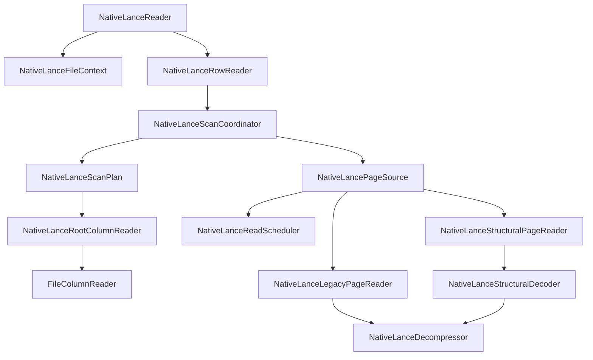
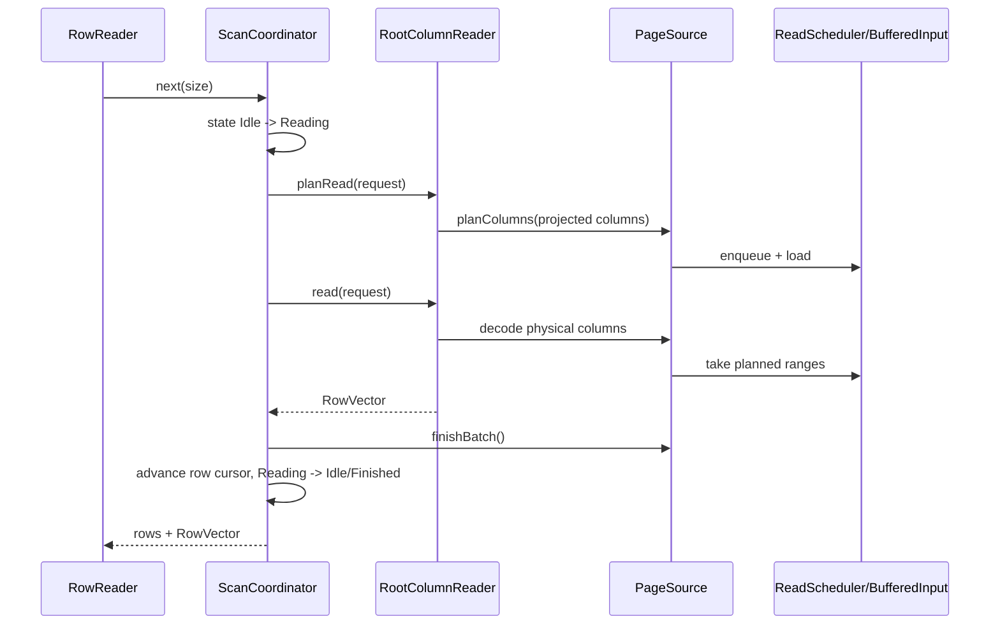
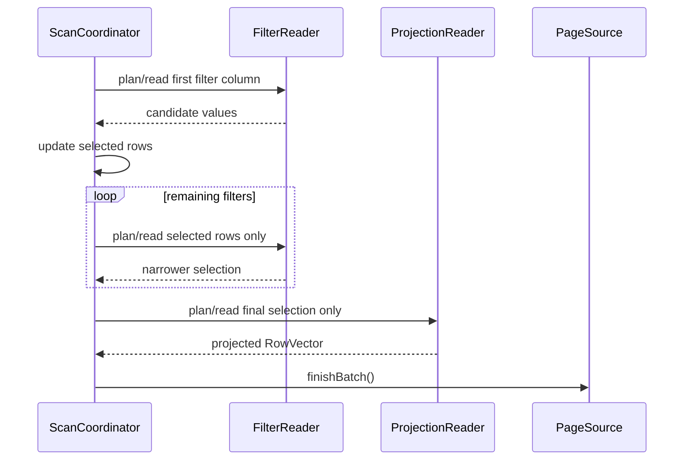
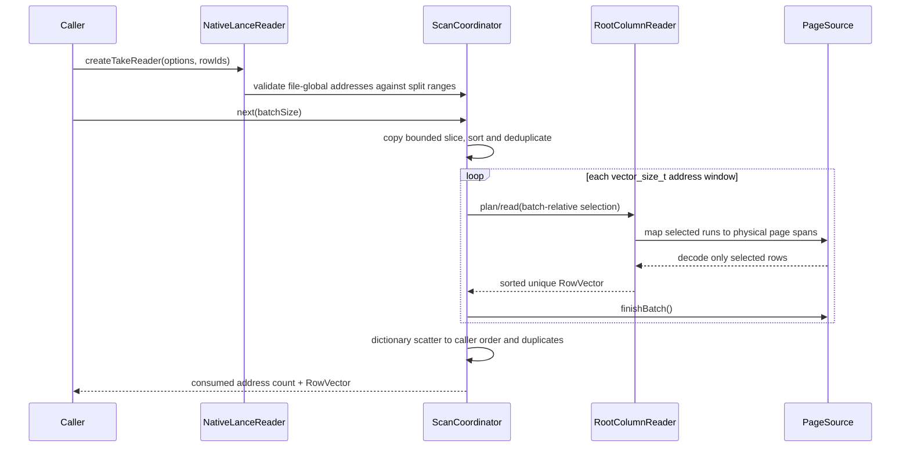
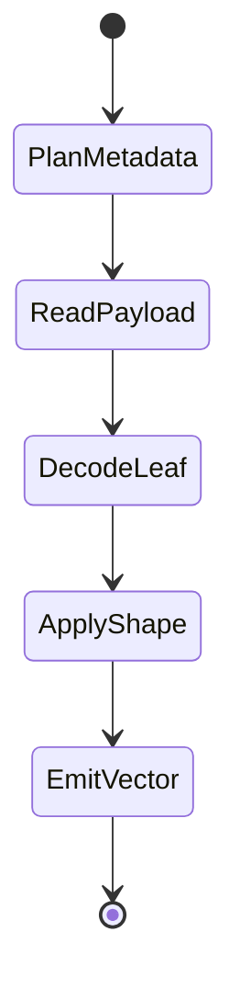
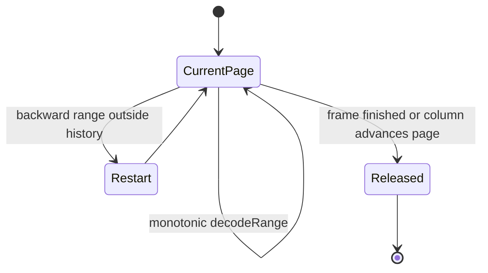

# Bolt Native Lance Reader 架构与状态设计

## 1. 目标

Native Lance Reader 面向大文件、超宽表和复杂嵌套类型，设计目标如下：

- 数据路径全部由 Bolt 管理，不通过 Rust FFI 或 Arrow RecordBatch 中转；
- 采用 stream decode，不缓存 decoded page 或 decompressed page；
- 文件元数据只构建一次，scan 期间只保留必要的 page 索引和 codec 状态；
- filter-first，先计算 selection，再读取 projection；
- 宽表可以并行解码，但不能以无限制增加驻留输入为代价；
- 状态机只用于真正跨 API 调用存活的状态，不为同步函数包装额外状态。

## 2. 所有权层次



### 2.1 FileContext

`NativeLanceFileContext` 是文件级不可变 owner：

- 持有 metadata 输入；
- 构造并验证 `NativeLanceMetadata`；
- 持有 `TypeWithId`、Blob resolver 和 read scheduler 参数；
- 为每个 RowReader clone 独立 `BufferedInput`。

文件打开是同步构造过程，不存在可暂停或恢复的 open task，因此不设置独立状态机。

### 2.2 ScanCoordinator

`NativeLanceScanCoordinator` 是唯一的扫描状态 owner。状态仅保留：

```cpp
enum class NativeLanceScanState : uint8_t {
  kIdle,
  kReading,
  kSkipping,
  kFinished,
  kFailed,
  kCancelled,
};
```

`next()` 和 `skip()` 跨公开 API 调用，因此需要状态保护重入、取消和终态。单个 batch
内部的 plan/decode/assemble 都是同步步骤，不再创建 ScanWindow、ColumnTask 或
BatchBuilder 状态机。

Coordinator 接受两种互斥的 row domain，且复用同一组状态和解码组件：

- 顺序扫描使用 `rowRanges + currentRange/currentRow`；
- row-addressed take 使用不可变 `rowIds + takePosition`。

take 不是第二套 reader。它只把当前地址批次规范化成已有
`NativeLanceColumnRequest::selection`，后续仍进入同一个 RootColumnReader、PageSource 和
PageReader。

### 2.3 ScanPlan 与 ColumnReader

`NativeLanceScanPlan` 在 RowReader 创建时完成：

- projection reader tree；
- filter column readers；
- split 对应的 row ranges；
- batch bytes 的行大小估算。

`NativeLanceRootColumnReader` 在构造时生成两个不可变执行表：

- row-aligned physical columns；
- offset-dependent physical columns。

执行表直接保存 `physical column -> reader`，避免每批排序、去重和线性查找。
不同逻辑类型不再使用无行为差异的派生 reader；编码和 layout 分派统一由 page
层完成。

### 2.4 PageSource 与 PageReader

`NativeLancePageSource` 是 scan-local I/O 与 page session owner：

- 把逻辑列映射到 physical page ranges；
- 将 ranges 提交给 `NativeLanceReadScheduler`；
- 管理 structural page plan；
- 管理 legacy Zstd stream session；
- 调用 legacy 或 structural page decoder。

`NativeLanceStructuralPageReader::read()` 是单页同步解码边界。它不复制 scan 状态，
也不持有跨调用结果。`NativeLanceStructuralPagePlan` 只缓存 MiniBlock chunk 元数据和
repetition index，不保存编码 payload 或解码结果。

`NativeLanceLegacyPageReader` 只在 Zstd 需要顺序解压时跨 batch 保留 codec cursor。
session 绑定到 `(physicalColumn, pageIndex)`，列游标进入下一页时立即回收旧页。

## 3. 扫描时序

### 3.1 无过滤全扫



整批 projection 仍作为一个 I/O plan 提交，以保留超宽表的批量 I/O 合并。解码并行度
由 RowReaderOptions 控制；batch 结束时释放没有被 decoder 接管的 scheduler buffer。

### 3.2 过滤扫描



外部或内部 prefetch 只规划第一个非 constant filter。projection 不得在 selection 产生前
预取，避免低选择性结果下读取整张宽表。

### 3.3 Row-addressed take



每次 `next(size)` 最多消费 `size` 个地址，并继续受 `maxBatchBytes` 约束。返回值是已消费
的地址数；有 filter 时可能大于输出行数。排序只改变内部访问顺序，最终 dictionary
scatter 恢复调用方顺序和重复项。跨度无法由 `vector_size_t` 表示时拆成多个 window，
不会把地址之间的空洞 materialize 成 vector。

take 禁用顺序 scan prefetch unit，因为随机地址不应触发整段 speculative prefetch；
Mutation 当前明确拒绝，避免把文件行域 deletion bitmap 与地址流位置混淆。

## 4. Prefetch 状态

Prefetch 只保留三种状态：`NotStarted`、`InProgress`、`Finished`。范围索引保持有序并
使用二分定位；Baton 仅在请求实际进入 `InProgress` 时创建，不为未来所有 batch 预先
分配同步对象。同步输入不会初始化 prefetch 元数据。

prefetch 状态不拥有 decoded data。它只表示对应 I/O plan 是否已经提交，真正的输入
buffer 归 `NativeLanceReadScheduler`，并在 batch 完成时释放未消费部分。

## 5. Page 生命周期

### 5.1 Structural



上述状态是执行阶段，不是独立对象状态。MiniBlock plan 可跨 batch 保留，但只包含小型
索引。struct/list/map 的 sibling branch 在组装前共享 canonical null/offset/size buffer，
避免多份相同 shape 同时驻留；leaf value buffer 保持独立。

### 5.2 Legacy Zstd



每个 session 只保留 codec context、一个压缩 chunk 和极小 history。禁止保留完整解压页。

## 6. 内存不变量

1. 输出 batch 由 `maxBatchBytes` 限制行数；超宽行至少允许一行。
2. scheduler-owned 输入只活到当前 batch，`finishBatch()` 清理未消费 ranges。
3. StringView 等零拷贝输出必须显式持有其底层 `BufferPtr`，清理 scheduler 不得使输出失效。
4. Structural page plan 只保存 metadata，不保存 encoded、decompressed 或 decoded payload。
5. Legacy Zstd session 只保留当前页，并在该 physical column 进入下一页时回收。
6. Filter prefetch 不得读取 projection；projection I/O 基于最终 selection。
7. 并行度不创建独立全局线程池，使用调用方注入的 query executor。
8. take 只保留当前地址批次、去重结果和最终 dictionary indices；不保留跨 batch 的
   decoded/decompressed page cache。

`maxInFlightBytes` 是单次 I/O 提交波次限制，不声明为所有解码临时内存的全局硬配额。
统一的硬内存限制由 Bolt `MemoryPool` 和 batch sizing 提供，避免维护一套未接线的旁路
budget 计数。

## 7. 关键接口

```cpp
class NativeLanceFileContext {
 public:
  NativeLanceFileContext(
      std::unique_ptr<dwio::common::BufferedInput> input,
      const dwio::common::ReaderOptions& options,
      std::shared_ptr<const NativeLanceBlobResolver> blobResolver,
      std::shared_ptr<const NativeLanceTypeAdapter> typeAdapter);

  const NativeLanceMetadata& metadata() const;
  std::unique_ptr<dwio::common::BufferedInput> newInput() const;
};

struct NativeLanceTakeOptions {
  std::shared_ptr<const std::vector<uint64_t>> rowIds;
};

class NativeLanceReader {
 public:
  std::unique_ptr<NativeLanceRowReader> createTakeReader(
      const dwio::common::RowReaderOptions& options,
      NativeLanceTakeOptions takeOptions) const;
};

class NativeLanceRootColumnReader {
 public:
  void planRead(
      NativeLancePageSource& source,
      const NativeLanceColumnRequest& request) const;

  VectorPtr read(
      NativeLancePageSource& source,
      const NativeLanceColumnRequest& request,
      memory::MemoryPool& pool,
      bool primaryRangesPlanned,
      const std::unordered_map<uint32_t, VectorPtr>* predecoded = nullptr) const;
};

class NativeLanceStructuralPageReader {
 public:
  VectorPtr read();
};

class NativeLanceReadScheduler {
 public:
  void schedule(BufferedInput& input, uint64_t offset, uint64_t length);
  void submit(BufferedInput& input);
  BufferPtr take(uint64_t offset, uint64_t length);
  void finishBatch();
  void cancel(BufferedInput* input = nullptr);
};
```

## 8. 错误与取消

- metadata 构造失败时不发布 `FileContext`；
- `ScanCoordinator` 捕获 batch 失败并进入 `Failed`；
- `cancel()` 幂等地取消 input、清理 scheduler、structural plans 和 legacy sessions；
- page decoder 不保存异常副本，异常直接沿唯一调用栈传播到 ScanCoordinator；
- 已发布的 output vector 不由 reader 再次修改。

## 9. 验证要求

- Native Lance 单测和 Hive TableScan 集成测试全部通过；
- 兼容 v2.0、v2.1、v2.2、v2.3 以及全部已声明类型；
- take 覆盖乱序、重复、空输入、非法地址、跨页复杂类型、null、过滤和 skip；
- 过滤用例校验输出行数与 checksum；
- 主验收数据使用 `/tmp/data-0ee2-v20-zstd9-full.lance`；
- Native/Rust 各运行七轮并交替顺序；
- 使用 paired log-ratio exact sign-flip 检验波动；
- 同时比较 scan time、wall time、peak RSS、pool peak 和最大输出 batch retained bytes；
- 不接受通过扩大 batch、扩大 readahead 或缓存解压页换取性能。
